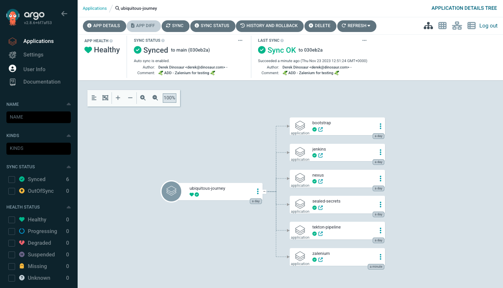
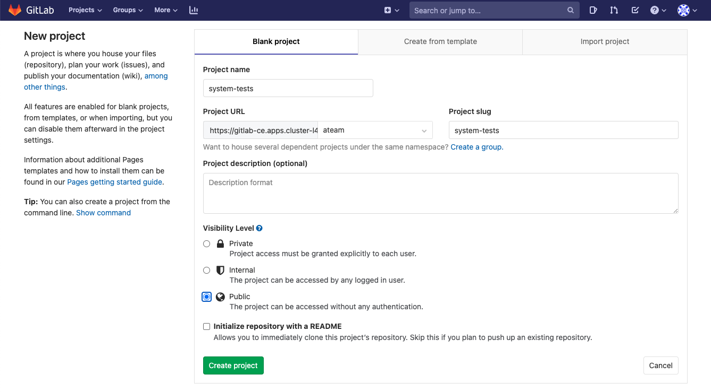
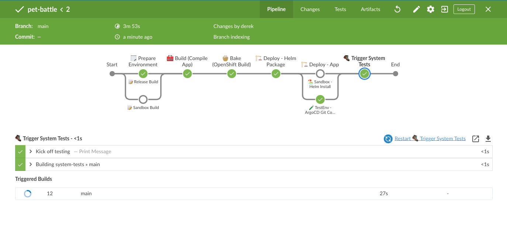
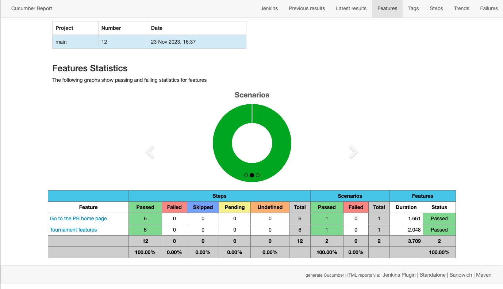
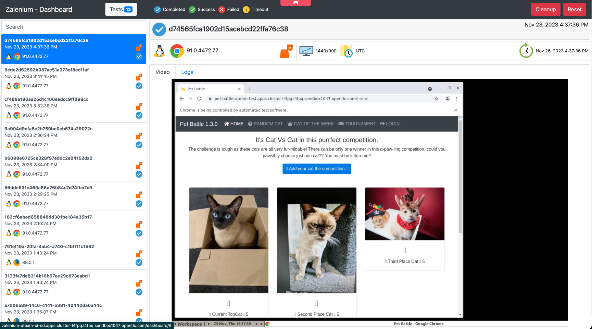

# 🦤 System Tests 🦤

> Validate the sum of the parts of the system are behaving as expected before moving them on to the next stage. Driving the front end as a user would, we can validate the system is working togther from all it's individual components.

## Task


### Deploy Zalenium (selenium grid for kube!)

> Zalenium is a flexible and scalable container based Selenium Grid with video recording, live preview, basic auth & dashboard.

1. To add Zalenium to our cluster, it's been packaged up as a helm chart. We can add this helm chart to our `values-tooling` file. Open this up in your Dev Spaces and add the configuration for `Zalenium` so our GitOps controller can pick it up and roll out the change 🐙

    ```yaml
      # Zalenium
      - name: zalenium
        enabled: true
        source: https://github.com/zalando/zalenium.git
        source_path: charts/zalenium
        source_ref: "master"
        values:
        hub:
            serviceType: ClusterIP
            openshift:
            route:
                enabled: true
            serviceAccount:
            create: false
            desiredContainers: 0
    ```

2. Commit the changes to see them reflected in ArgoCD

    ```bash#test
    cd /projects/tech-exercise
    git add .
    git commit -m  "🥒 ADD - Zalenium for testing 🥒"
    git push
    ```

    


### Add the System Tests to git and execute our pipeline

> An existing project containing some end to end tests and a corresponding Jenkinsfile have been created for you. They use JavaScript to execute. These tests are written in a BDD style syntax and are fairly basic but illustrative of what can be achieved with automated testing


1. Open GitLab and create a new project called `system-tests`. Make it *public* and ensure it's within your team name (`<TEAM_NAME>`) group (`ateam`  in the screenshot below)

    


2. In your Dev Spaces, fork the upstream `system-tests` project and push it to the new GitLab project.

    ```bash#test
    cd /projects
    git clone https://github.com/petbattle/system-tests.git && cd system-tests
    git remote set-url origin https://${GIT_SERVER}/${TEAM_NAME}/system-tests.git
    git branch -M main
    git push -u origin main
    ```

3. Jenkins is setup automatically to scan repositories for a `Jenkinsfile` so it will detect this new pipeline automatically. Login to see it in place :) [🦵 if it doesn't appear within a few seconds, you can probs just kick the `seed-multibranch-pipelines` job and it will appear a moment after]

    

4. This job can be manually run - but we want to automate everything! So let's join up the Jenkins front end pipeline to this suite of tests and only then promote our application. Open the `pet-battle/Jenkinsfile` and append the following snippet to trigger the build of the downstream job under the heading `// 🥾 Trigger System Tests` as shown below:

    ```groovy
            // 🥾 Trigger System Tests

            stage("🥾 Trigger System Tests") {
              options { skipDefaultCheckout(true) }            
              agent { label "master" }
              when { expression { GIT_BRANCH.startsWith("master") || GIT_BRANCH.startsWith("main") }}
              steps {
                    echo "Kick off testing"
                    build job: "system-tests/main", 
                                parameters: [[$class: 'StringParameterValue', name: 'APP_NAME', value: "${APP_NAME}" ],
                                            [$class: 'StringParameterValue', name: 'CHART_VERSION', value: "${CHART_VERSION}"],
                                            [$class: 'StringParameterValue', name: 'VERSION', value: "${VERSION}"]], 
                                wait: false
              }
            }
    ```

5. With the trigger in place, let's bump our application version. Edit the `package.json` in the root of the `pet-battle` front end repository and bump the version to a new number eg `1.3.0` as per below (this might differ for your env depending on how many of the other modules you've done 🦆🍔)

    ```json
    {
        "name": "pet-battle",
        "version": "1.3.0",
        // more stuff here
    }
    ```

6. Commit these changes to see the whole picture come together on Jenkins.

    ```bash
    cd /projects/pet-battle
    git add .
    git commit -m  "🦤 ADD - new Jenkins step and version change 🦤"
    git push
    ```

7. On Jenkins you should see the builds kicking off - and see how one triggers the other. Jenkins job for Pet Battle also has an additional stage

    

    

    <p class="warn">
    ⛷️ <b>NOTE</b> ⛷️ - If you have not created definitions in your `pet-battle/stage/values.yaml` for the stage environment, the last step will fail. Have a <a href="/tech-exercise/#/2-attack-of-the-pipelines/2-app-of-apps?id=deploying-pet-battle">look here for instructions to fix this</a> if you've skipped step 4 from exercise 2. 
    </p>

8. Once the job has executed successfully, you can show the reports of the test execution and what browswer was used etc. To view this report, you need to swap to classic jenkins view and go to `system-tests/main` job. On the left hand side you'll see the `Cucubmer Reports` on the menu. 

    

9. Zalenium also has some cool features, you can show the tests execution both live and via the recording. Just go to the url of your running Zalenium http://zalenium-<TEAM_NAME>-ci-cd.<CLUSTER_DOMAIN>/dashboard to see a recording of the test cases executing. Note - for the live execution of tests it's http://zalenium-<TEAM_NAME>-ci-cd.<CLUSTER_DOMAIN>/grid/admin/live?refresh=5

