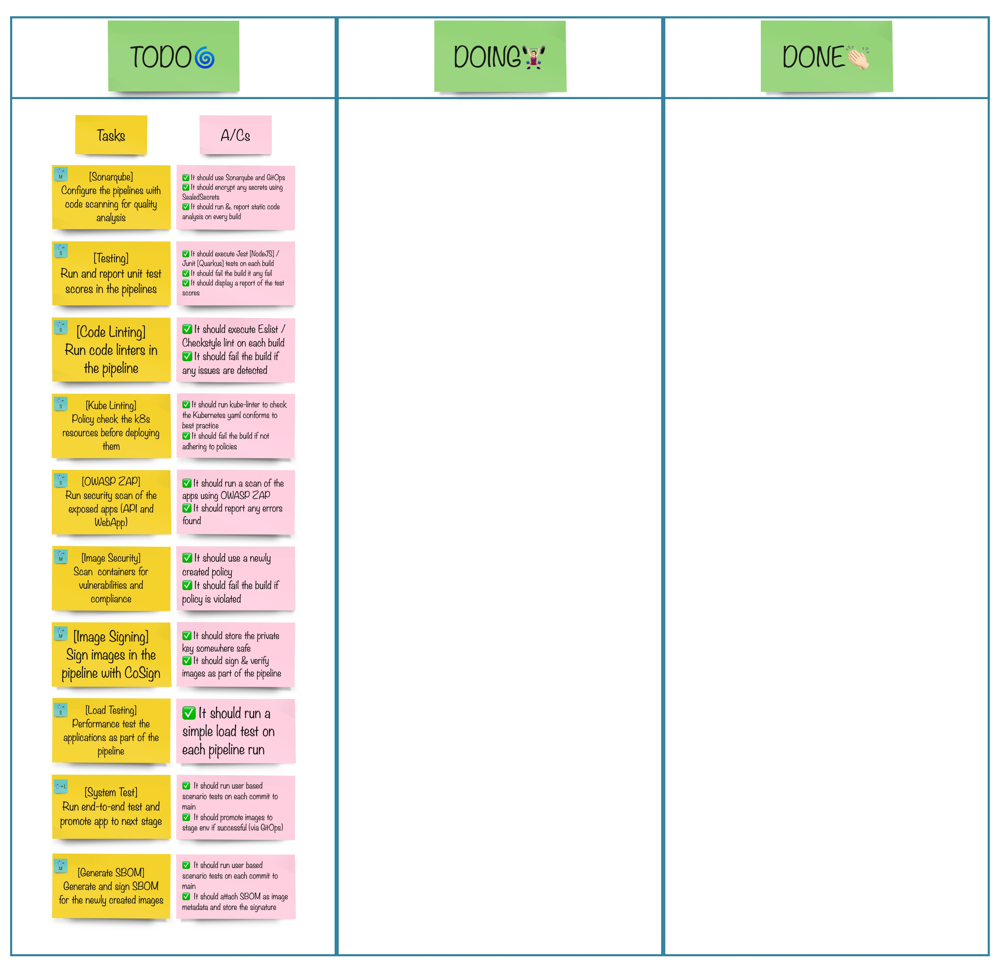
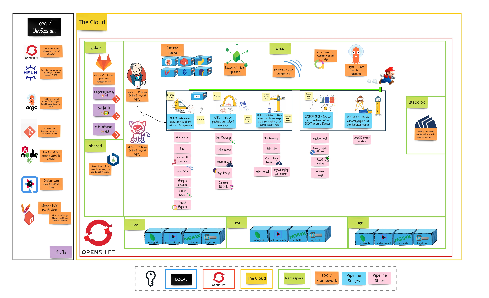

# Exercise 3 - Revenge of the Automated Testing

> Continuous Testing - End-to-end testing looks good, but is invariably bad because it will never catch all the bugs. What we really need is continuous testing.

Continuous Delivery needs rapid and reliable feedback. Investing in continuous testing is a worthwhile activity.

## 👨‍🍳 Exercise Intro

**💥 Choose your own adventure 💥**

There are lots of things we can do under the heading of `Quality Gates`, so decide for yourselves what you'd like to do. In your table groups, create a Kanban with each of the exercise titles. Discuss among yourselves the order you'd like to do them in and as mobs / pairs, take tasks from the list and implement them. At the end of each section, play back to the other group what you've accomplished. Then grab the next prioritized item on your list!

To onboard a new group in your team, follow this [guide](2-attack-of-the-pipelines/3c-create-new-group.md).

## 🖼️ Big Picture

## 🔮 Learning Outcomes

- [ ] Can add security gates to pipeline
- [ ] Can add testing gates to pipeline
- [ ] Can add static code analysis gates to pipeline
- [ ] Can add image signing to the pipeline
- [ ] Can generate and store SBOMs
- [ ] Can add load testing to the pipeline

## 🔨 Tools used in this exercise!

* [Sonar](https://www.sonarqube.org/) - Add static code analysis to the pipelines.
* Testing Tools - [Jest](https://jestjs.io/), [Allure](https://github.com/allure-framework/allure2), [RESTassured](https://quarkus.io/guides/getting-started-testing) - Add API and frontend tests.
* Code Linting - [npm lint](https://www.npmjs.com/package/lint), [checkstyle](https://checkstyle.sourceforge.io) - Static code linter and coverage reports for our tests.
* Kube Linting - [kubelinter](https://github.com/stackrox/kube-linter)- Validate K8s YAMLs against best practices.
* [ZAP - OWASP](https://owasp.org/www-project-zap) application scanning to check for common attack patterns.
* Image Security - [StackRox](https://www.stackrox.com) - Finding vulnerabilities inside the images and hosts with StackRox.
* Image Signing - [sigstore](https://www.sigstore.dev) - Sign your images with cosign.
* SBOMs - [Syft](https://github.com/anchore/syft) - Generate a Software Bill of Materials (SBOM) from container images.
* Load Testing - [locust](https://docs.locust.io/en/stable/index.html) - Automated load tests in your pipeline.
* System Test - test the system before promoting to the next stage.
