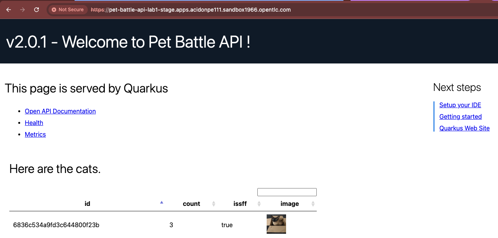
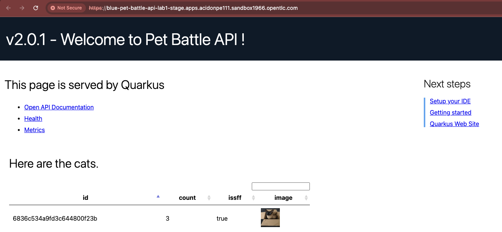

## Extend Tekton Pipeline with Blue/Green Deployments

Let's deploy PetBattle Blue and green itself. Each environment folder (test / stage) contains the configuration for the corresponding projects in OpenShift. All we need to do is extend or edit the list of `applications` for the changes to be synced to the cluster. We can also separate test environment config from staging or even prod using this method.

1. Let's create two new deployments in our ArgoCD Repo for the pet-battle-api. We'll call one Blue and the other Green. Add 2 new application in `tech-exercise/pet-battle/stage/values.yaml`. Adjust the `source_ref` helm chart version and `image_version` to match what you have built.

    ```bash
    cat << EOF >> /projects/tech-exercise/pet-battle/stage/values.yaml
      # Pet Battle API Blue
      blue-pet-battle-api:
        name: blue-pet-battle-api
        enabled: true
        source: http://nexus:8081/repository/helm-charts
        chart_name: pet-battle-api
        source_ref: 1.5.0  # <----------- IMPORTANT: Define the current Pet Battle API version
        values:
          image_name: pet-battle-api
          image_version: latest
          hpa:
            enabled: false
      # Pet Battle API Green
      green-pet-battle-api:
        name: green-pet-battle-api
        enabled: true
        source: http://nexus:8081/repository/helm-charts
        chart_name: pet-battle-api
        source_ref: 1.5.0  # <----------- IMPORTANT: Define the current Pet Battle API version
        values:
          image_name: pet-battle-api
          image_version: latest
          hpa:
            enabled: false
    EOF
    ```

2. Push your changes to the repo. _It's not real unless it's in git_

    ```bash
    cd /projects/tech-exercise
    git add .
    git commit -m  "🐩 ADD - pet battle APIs blue & Green 🐩"
    git push 
    ```

3. Let's see if the whole thing is working.
    </br>
    🪄 🪄 You should be able to see the Pet Battle API Blue & Green Applications running. 🪄 🪄

     ```bash#test
    https://blue-pet-battle-api-<TEAM_NAME>-stage.<CLUSTER_DOMAIN>
    https://green-pet-battle-api-<TEAM_NAME>-stage.<CLUSTER_DOMAIN>
    https://pet-battle-api-<TEAM_NAME>-stage.<CLUSTER_DOMAIN>
    ```   

4. Let's add this task into pipeline. Edit `tekton/templates/pipelines/maven-pipeline.yaml` and copy below yaml where the placeholder is. Make sure you update `runAfter` accordingly.

    ```yaml
      # Blue/Green Deployment
      - name: promote-image-stage
        taskRef:
          name: promote-image-stage
        workspaces:
          - name: output
            workspace: shared-workspace
        params:
          - name: APPLICATION_NAME
            value: "$(params.APPLICATION_NAME)"
          - name: TEAM_NAME
            value: "$(params.TEAM_NAME)"
          - name: VERSION
            value: "$(tasks.maven.results.VERSION)"
        runAfter: 
          - verify-deployment # <-------- Update this runafter properly
        
      - name: analyze-bg-deployment
        taskRef:
          name: analyze-bg
        workspaces:
          - name: output
            workspace: shared-workspace
        params:
          - name: APPLICATION_NAME
            value: "$(params.APPLICATION_NAME)"
          - name: TEAM_NAME
            value: "$(params.TEAM_NAME)"
          - name: PREVIOUS_VERSION
            value: "$(tasks.deploy-test.results.PREVIOUS_VERSION)"
          - name: WORK_DIRECTORY
            value: "tech-exercise/main/pet-battle/"
          - name: DEPLOY_ENVIRONMENT
            value: "stage"
        runAfter: 
          - promote-image-stage

      - name: deploy-bg
        taskRef:
          name: deploy
        workspaces:
          - name: output
            workspace: shared-workspace
        params:
          - name: APPLICATION_NAME
            value: "$(tasks.analyze-bg-deployment.results.BG_APPLICATION_NAME)"
          - name: WORK_DIRECTORY
            value: "tech-exercise/main/pet-battle/"
          - name: DEPLOY_ENVIRONMENT
            value: "stage"
          - name: TEAM_NAME
            value: "$(params.TEAM_NAME)"
          - name: VERSION
            value: "$(tasks.maven.results.VERSION)"
          - name: CHART_VERSION
            value: "$(tasks.helm-package.results.CHART_VERSION)"
        runAfter: 
          - analyze-bg-deployment
      
      - name: verify-bg
        taskRef:
          name: verify-deployment
        workspaces:
          - name: output
            workspace: shared-workspace
        params:
          - name: WORK_DIRECTORY
            value: "tech-exercise/main/pet-battle/"
          - name: PREVIOUS_VERSION
            value: "$(tasks.deploy-test.results.PREVIOUS_VERSION)"
          - name: PREVIOUS_CHART_VERSION
            value: "$(tasks.deploy-test.results.PREVIOUS_CHART_VERSION)"
          - name: TEAM_NAME
            value: "$(params.TEAM_NAME)"
          - name: VERSION
            value: "$(tasks.maven.results.VERSION)"
          - name: APPLICATION_NAME
            value: "$(tasks.analyze-bg-deployment.results.BG_APPLICATION_NAME)"
          - name: DEPLOY_ENVIRONMENT
            value: "stage"
        runAfter:
          - deploy-bg

      - name: deploy-bg-route-stage
        taskRef:
          name: deploy-bg-route
        workspaces:
          - name: output
            workspace: shared-workspace
        params:
          - name: WORK_DIRECTORY
            value: "tech-exercise/main/pet-battle/"
          - name: TEAM_NAME
            value: "$(params.TEAM_NAME)"
          - name: VERSION
            value: "$(tasks.maven.results.VERSION)"
          - name: APPLICATION_NAME
            value: "$(params.APPLICATION_NAME)"
          - name: BG_COLOR
            value: "$(tasks.analyze-bg-deployment.results.BG_COLOR)"
          - name: DEPLOY_ENVIRONMENT
            value: "stage"
        runAfter: 
          - verify-bg
        
    ```

5. Remember -  if it's not in git, it's not real.

    ```bash
    cd /projects/tech-exercise
    git add .
    git commit -m  "🔵 ADD - Blue / Green deployment to pipeline 🟩"
    git push
    ```

6. Now it's time to trigger the pipeline via webhook by checking in some code for Pet Battle API. Lets make a simple change to the application version. Edit pet-battle-api `pom.xml` found in the root of the `pet-battle-api` project and update the `version` number. The pipeline will update the `chart/Chart.yaml` with these versions for us.

    ```xml
        <artifactId>pet-battle-api</artifactId>
        <version>2.0.1</version>
    ```

    You can also run this bit of code to do the replacement if you are feeling uber lazy!

    ```bash#test
    cd /projects/pet-battle-api
    mvn -ntp versions:set -DnewVersion=2.0.1
    ```

7. Make a change un your Pet Battle API application introducing the version in the HTLM file `/projects/pet-battle-api/src/main/resources/META-INF/resources/index.html` (line 118).

   ```bash
    <div class="banner lead">
        v2.0.1 - Welcome to Pet Battle API !
    </div>
  ```

7. As always, push the code to git ...

    ```bash
    cd /projects/pet-battle-api
    git add .
    git commit -m  "🍕 UPDATED - pet-battle-version to 2.0.1 🍕"
    git push
    ```

    🪄 Observe the **pet-battle-api** pipeline running with the **bg-deployment** task.

8. When Tekton executes, you should see things progress and the blue or green deployment happen automatically.

    The version in production is now the new `2.0.1` published with the latest change. As you can check from the
    nav bar of the application from the production route `pet-battle-api` (linked to the `blue` service):

    

    

    The previous `1.5.0` version, now identified as `green`, is already available from the green route `pet-battle-api`:

    

    Every time you change the `version` variable in the `pom.xml` and the HTLM file, the blue and green version will switch. Try it
    publishing a new version of the application, e.g: `2.0.2`. Which one is in production? Which is `blue`? Which is `green`?

    This is a simple example to show how we can automate a blue green deployment using GitOps. However, we did not remove the
    previous deployment of pet-battle, in the real world we would do this.